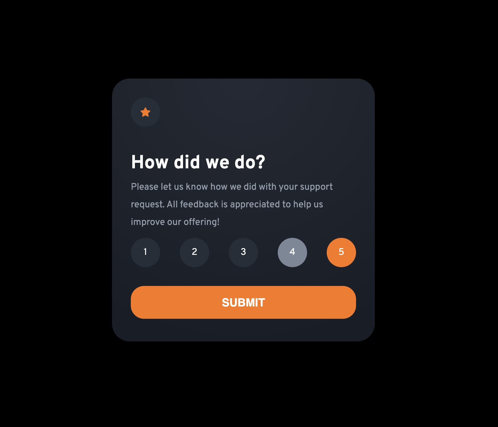

# Frontend Mentor - Interactive rating component solution

This is a solution to the [Interactive rating component challenge on Frontend Mentor](https://www.frontendmentor.io/challenges/interactive-rating-component-koxpeBUmI). Frontend Mentor challenges help you improve your coding skills by building realistic projects. 

## Table of contents

- [Overview](#overview)
  - [The challenge](#the-challenge)
  - [Screenshot](#screenshot)
  - [Links](#links)
- [My process](#my-process)
  - [Built with](#built-with)
  - [What I learned](#what-i-learned)
- [Author](#author)
- [Acknowledgments](#acknowledgments)

## Overview

### The challenge

Users should be able to:

- View the optimal layout for the app depending on their device's screen size
- See hover states for all interactive elements on the page
- Select and submit a number rating
- See the "Thank you" card state after submitting a rating

### Screenshot




### Links

- Solution URL: (https://github.com/shobanamg/interactive-rating-component)
- Live Site URL: (https://interactive-rating-component-shobanamg.vercel.app/)

## My process

### Built with

- Flexbox
- [React](https://reactjs.org/) - JS library
- [Styled Components](https://styled-components.com/) - For styles


### What I learned

When I was doing this Project, I have learned how to pass props down from the parent component to  child component, 
and also I discovered a useful tool called styled components which helped me make my project look better
```jsx
<ThankYouImgWrapper>
  
</ThankYouImgWrapper>
```
```styled components
export const ThankYouImgWrapper = styled.div`
  max-width: 100%;
`;
```

## Author

- Website - [Shobana Mathiarul](https://www.your-site.com)
- Frontend Mentor - [@shobanamg](https://www.frontendmentor.io/profile/yourusername)
- Twitter - [@ShobanaMathiarul](https://www.twitter.com/yourusername)


## Acknowledgments

My sincere thanks to [HackYourFuture/Copenhagen](https://www.hackyourfuture.dk/) to giving this opportunity to do this project from front end mentor.